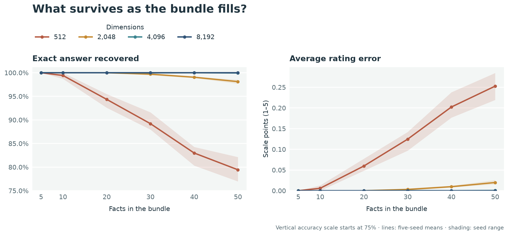
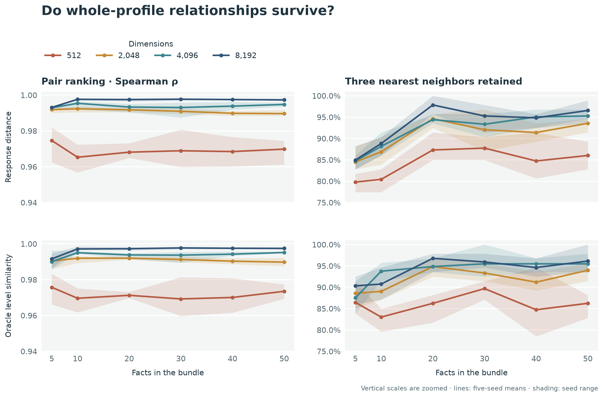
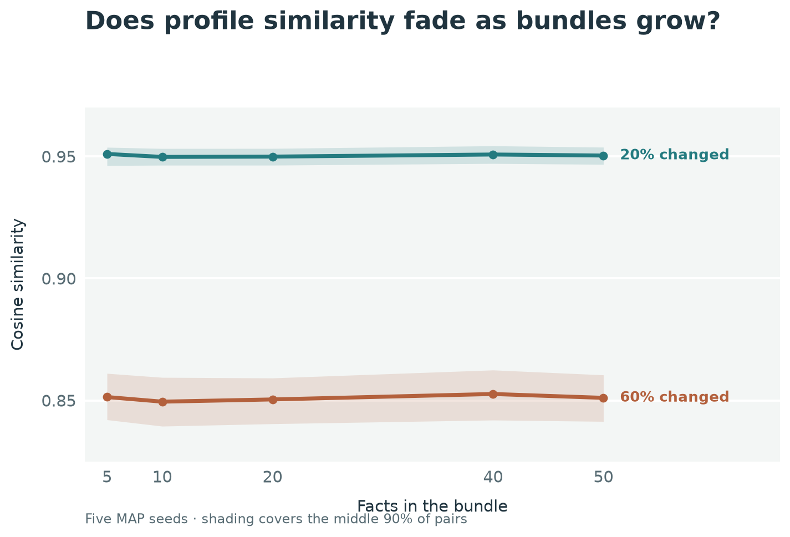

# When a bundle remembers the profile but misses an answer

Suppose we pack a person's answers to 50 questionnaire items into one hypervector. We might ask it for a particular answer, or use it to find people whose overall answer patterns look alike. Those two jobs place different demands on the same bundle. Knowing where each one starts to fail helps us choose a useful vector size.

We tried both with the [IPIP 50-item Big-Five sample questionnaire](https://www.ipip.ori.org/New_IPIP-50-item-scale.htm) and 31 fixed **synthetic** profiles. Each profile has one raw response, from 1 to 5, at every item position. The experiment asks what survives when those answers share one vector.

## Give each position its own key

The encoder assigns each of the 50 item IDs an independent random bipolar MAP vector. Every profile reuses those same keys. A shared set of five TorchHD level vectors represents scored responses 1–5; nearby levels overlap more than distant ones. This separates *which question* we asked from *how strongly* someone answered it.

Before encoding, we follow the [published IPIP scoring directions](https://ipip.ori.org/newBigFive5broadKey.htm). A `+` item keeps its raw value; a `-` item maps raw response `r` to `6 − r`. For example, Q19 (“Seldom feel blue”) is `+` keyed and Q49 (“Often feel blue”) is `-` keyed. Raw answers of 5 and 1 both become scored level 5. They still have **different item keys** and remain separate facts. Factor IV's keyed direction is Emotional Stability.

For each fact, we multiply its item key by its scored level vector, then add the bound vectors without a final sign operation. To read Q19, we multiply the bundle by Q19's key. That gives us a noisy version of its answer because the other 49 facts are still in the sum. The five stored, clean level vectors serve as a small **cleanup memory**: we choose whichever one is closest to the noisy result, then reverse the item rule to recover a raw response. Keeping question wording out of the encoder lets us focus on what happens as more facts enter the sum.

## More facts make individual answers harder to read

Every added fact contributes to the noise we must untangle to recover one answer. The cleanup memory still contains the same five possible answers; only the bundled signal gets more crowded. Sometimes another fact's signal makes cleanup choose the wrong level.

The chart shows both exact recovery and **average rating error**: the average number of points between the recovered answer and the true answer on the 1–5 scale. If the true answer is 4 and cleanup returns 3, the error is 1; if it returns 1, the error is 3. No error was added to the questionnaire; this measures mistakes made when reading an answer back from the bundle. It tells us whether wrong answers are usually close misses or large jumps. Exact recovery counts both mistakes equally.

We used nested bundles of 5, 10, 20, 30, 40, and 50 items; the figure averages 31 fixed profiles over five MAP seeds, with shading showing the seed range. The accuracy axis starts at 75% to reveal differences near the top.

At 512 dimensions, crowding mainly costs us **precision**. With five facts, cleanup reads every answer correctly. With 50, it reads **79.4%** exactly, but **96.1%** are either correct or just one point away. The bundle often keeps the rough rating even when it can no longer tell us the exact one.

More dimensions protect the exact answer. With 50 facts, recovery rises to **98.1%** at 2,048 dimensions; at 4,096, only **four of 7,750** readouts are wrong; at 8,192, none are wrong in this run. The four misses at 4,096 are all one-point errors where the two best cleanup choices nearly tie. A system using bundle readout could check the original answer in those uncertain cases. Moving from 2,048 to 4,096 dimensions doubles the raw float16 vector from about **4 KiB to 8 KiB**, so the practical choice is how much space to spend for more reliable per-question answers.

## The profile relationships survive better

The second job is finding similar complete profiles: if two profiles have similar answers to the **same items**, do their bundled vectors end up close together? This comparison uses the whole bundled vectors directly; it never has to unbind an item or make a five-way cleanup decision. We compared bundle similarity with the mean difference between matching answers and with the similarity predicted by the five level vectors before bundling. We then checked both the ranking of all profile pairs and each profile's three nearest neighbors.

At 50 facts and 512 dimensions, the bundles recover 79.4% of individual answers, yet their ranking of profile pairs agrees strongly with the original answer lists (Spearman **0.970**). They retain **86%** of the three nearest neighbors. That gap between strong overall ranking and imperfect nearest-neighbor overlap is useful to see: a map can get the broad layout right while swapping a few close candidates. At 2,048 dimensions, three-neighbor overlap reaches **93.5%**; at 8,192, **96.6%**. Choosing three neighbors at random from the other 30 would overlap by about 10%.

Here's the surprising part: adding facts can make cleanup harder while improving whole-profile comparison. At 512 dimensions, exact answer recovery falls from 100% at five facts to 79.4% at 50, while three-neighbor overlap rises from about 80% to 86% against the corresponding answer lists. Cleanup has to decide which clean level is closest to one noisy item. Similarity search can use the fuller pattern of all the facts at once. The effect is clearer at wider dimensions, where the extra facts add profile information with little loss of exact readout.

## Does similarity fade as bundles grow?

Imagine comparing two patients whose questionnaire answers are mostly alike. As we pack more answers into each bundle, do their hypervectors stay close, or does that similarity fade because the bundles have grown? To test this at **4,096 dimensions**, we made controlled pairs from each profile: we changed exactly **20%** of its raw answers by one scale point, choosing positions at random and moving boundary answers inward. We also changed **60%** by one point to make a farther comparison. We re-scored the changed answers, rebuilt their MAP bundles with the same item keys, and compared each changed bundle with its original. Answer positions were sampled throughout the prefix; there is no special “last” position in this additive bundle.

If bundling preserves similarity, the 20% pairs should keep about the same cosine as the bundle grows and remain closer than the 60% pairs. The shared five-level answer codebook gives an ideal before-bundling comparison: if that stays flat while bundle cosine falls, packing is diluting the similarity signal. The figure combines five MAP seeds; shaded bands show where the middle 90% of the pair measurements fall.

The 20% pairs stay at about **0.95 cosine** across all five widths, almost exactly matching their ideal answer-level similarity. The 60% pairs stay around **0.85**. There is no visible collapse of the similar-profile signal by 50 facts at 4,096 dimensions. Adding more matched answers preserves the *proportion* of small changes in the whole-vector comparison, even though reading any one answer from a crowded bundle is a different task.

This gives a concrete use for whole-bundle **cleanup**: a memory of stored questionnaires could still surface a similarly answered profile after several responses shift by one point. The original responses remain available when exact answers matter. These synthetic profiles contain almost no naturally close *different* people, so a study with such respondents would be the next test of patient-to-patient matching.

## How might we use this?

Imagine a research tool looking for respondents with similar answer patterns. It could compare their whole bundles to suggest candidates, then display exact responses from the source table for inspection. On this fixture, **2,048 dimensions** already give strong candidate lists and near-exact answers from cleanup. A workflow that asks the vector for specific answers might choose **4,096 dimensions** and use a small gap between the best and second-best cleanup matches to trigger an exact lookup. The result suggests choosing dimension for the job the vector actually does: recovering one answer (*item readout*) or keeping similar whole profiles close (*profile geometry*).

These 31 synthetic profiles come from five factor anchors. The bundle widths also follow fixed questionnaire prefixes, so more facts and different item content arrive together. A next study with varied respondents and item subsets could test similarity between naturally close people, while a margin-based exact-record fallback could measure how often item cleanup needs help.

The [saved measurements and reproducibility notes](src/qa-encoding/README.md) include per-item errors, profile-pair comparisons, key overlap, level similarities, versions, and input hashes.

## What we learned

| Experiment | High-level finding | What it suggests |
| --- | --- | --- |
| Answer cleanup as facts accumulate | Recovering one exact answer gets harder in a crowded, small bundle; 4,096 dimensions recovered all but four of 7,750 answers at 50 facts. | Choose dimension and an exact-record fallback according to how precise the answer must be. |
| Finding similar questionnaires | At 50 questions, 512-dimensional bundles recovered 79.4% of exact answers but kept 86% of the three closest profile matches. At 8,192 dimensions, that match overlap reached 96.6%. | Even when a bundle is imperfect at telling us one exact answer, it can still help find questionnaires that look alike overall. |
| Similarity as bundles grow | At 4,096 dimensions, 20% one-step changes stayed near 0.95 cosine from five through 50 facts, while 60% changes stayed near 0.85. | Similar answer patterns can remain close in hyperspace as more questions are added. |
