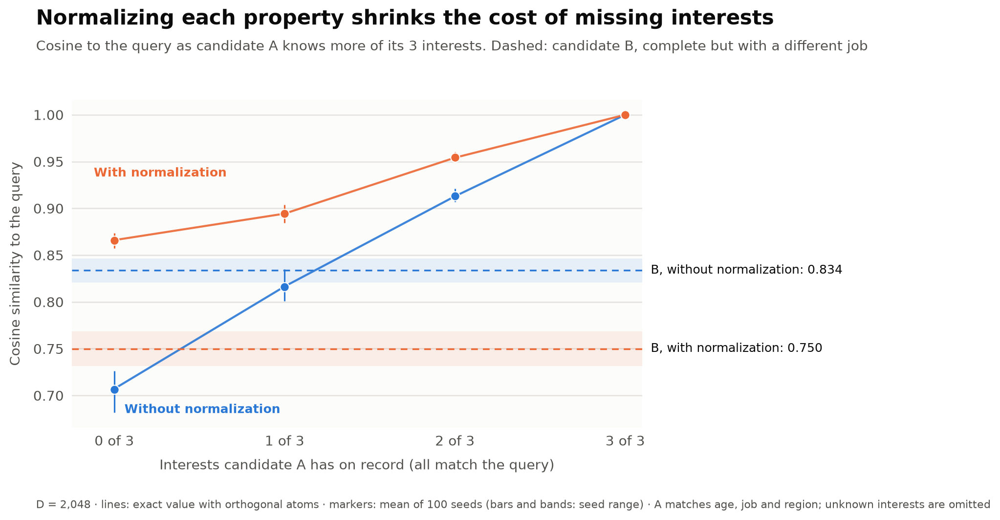
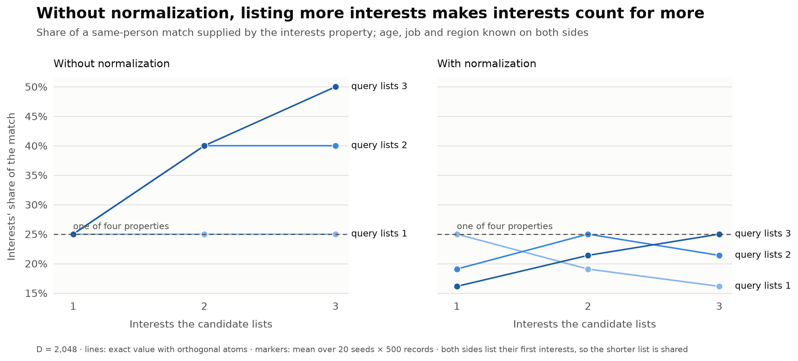
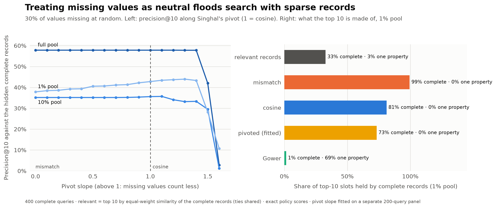
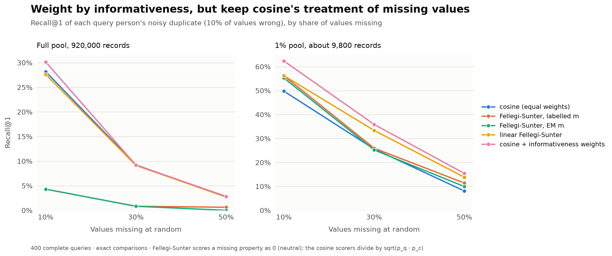
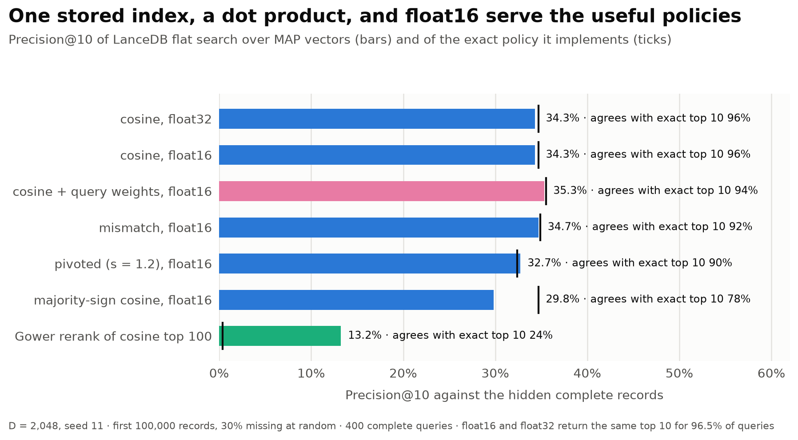
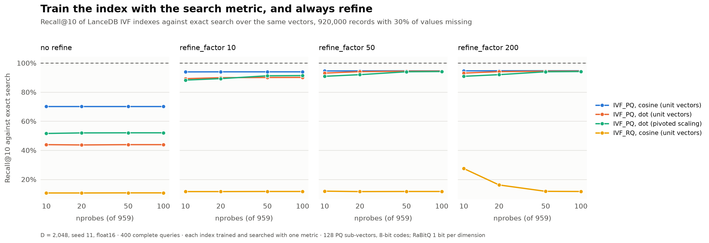

# Missing data is a normalization problem

Records in the wild are incomplete. One person lists three interests, another lists one, a third never filled in their job. When records become hypervector bundles, a missing value seems to need no decision: leave its fact out and compare by cosine. This study shows that leaving it out is right, but that it hides two real decisions, and that statistics, information retrieval and record linkage each made those decisions long ago:

1. **How much each property counts.** Should a property's weight depend on how many values a record happens to list?
2. **What a missing property costs.** Is "unknown" as bad as "wrong", neutral, or somewhere in between?

We answer both with five experiments on one small, fully specified record type. Code and settings are in the [README](README.md) and [methodology](METHODOLOGY.md).

## The record and the two encodings

Each synthetic `PERSON` has an age band (10 ordered levels), a job (8), a region (5) and three interests out of 25; the [scale study](../scale/REPORT.md) uses all 920,000 combinations. Each value is **bound** to its property's role, $h_{\mathrm{role},p} \otimes h_{p,v}$, and a record **bundles** the results with $\oplus$, computed as an arithmetic sum without a sign threshold. Unknown values are left out.

- **Without normalization** (the scale study's encoder), every known value is one fact. Age, job and region give one fact each; three interests give three.
- **With per-property normalization**, a property's values are bundled first, $h_p = \bigoplus_{v} h_{p,v}$, scaled to unit length, and then bound: $h_{\mathrm{record}} = \bigoplus_p h_{\mathrm{role},p} \otimes (h_p / \lVert h_p \rVert)$. Every known property contributes the same length, however many values it lists.

## 1. Without normalization, the data entry decides what matters

Take a query with an age band, a job, a region and three interests, and two candidates:

- **A** matches age, job and region and has k of the query's interests on record, the rest unknown.
- **B** is complete and matches age, region and all three interests, but has a different job.

Without normalization, the query's three interests make up half of its six facts, so the interest agreement outweighs B's wrong job: **B scores 0.833 and beats A with one interest (0.816)** in 99% of 100 seeds. With normalization, interests are one property of four. **A wins at every k**, and even A with no interests at all (0.866) beats B (0.750). Every measured cosine sits within 0.01 of its exact value.

The same pattern holds across many records. For two copies of the same person, the share of the match supplied by interests depends on how many each side lists:

Without normalization, interests supply **25%, 40% or 50%** of the match as both sides list one, two or three. With normalization they supply **at most 25%**, one property in four, and less when the lists differ: one listed interest against three earns √(1/3) ≈ 0.58 of the interest vote, a **16%** share. Normalization doesn't fill in what's missing; partial knowledge earns partial credit.

**Takeaway:** normalize each property, so that a property's weight is a choice in the schema, not a side effect of how much someone typed.

## 2. What a missing property should cost: cosine is the right default

With orthogonal atoms, the dot product of two normalized records is the **sum of per-property similarities over the properties both know**. Policies for missing data differ only in what they divide by:

| Policy | Divides by | A missing property counts as |
| --- | --- | --- |
| Gower (statistics, 1971) | properties both records know | neutral |
| cosine (what normalized bundles give) | √(properties in query × in candidate) | partly neutral |
| mismatch | properties in the query | a mismatch |
| pivoted (information retrieval, Singhal et al. 1996) | a tunable mix of cosine and mismatch | a fitted slope; above 1 leans neutral |

In a pairwise comparison, Gower's neutrality sounds fair: a record shouldn't be punished for what it doesn't say. Search is different. We masked every record at random (10%, 30% or 50% of values), searched 400 complete queries against pools of 920,000, about 92,000 and about 9,800 records, and judged each top 10 against the ranking the same policy would give **if nothing were missing**.

| 30% missing | Full pool | 10% pool | 1% pool |
| --- | --- | --- | --- |
| mismatch | 57.8% | 35.1% | 37.8% |
| cosine | 57.8% | 35.6% | 42.8% |
| pivoted, fitted slope | 57.8% (s = 1.0) | 35.6% (s = 1.0) | 43.7% (s = 1.2) |
| Gower | **0.3%** | **0.7%** | **6.7%** |

- **Neutral is a disaster in search.** A record that knows one property and matches it scores a perfect 1.0 under Gower, and among hundreds of thousands of records there are many of them. At 30% and 50% missingness they fill **69–88% of Gower's top-10 slots** in every pool, while relevant records are almost never that sparse (3% at 30% missingness). Even at 10% missingness Gower trails cosine by 16–58 points.
- **Cosine's partial neutrality is right or nearly right everywhere.** Fitting Singhal's pivot on a separate query panel lands exactly on cosine in **6 of 9** cells and gains at most one point elsewhere (slopes 0.8–1.2). Pushing past about 1.4 floods the results with sparse records, as Gower does.
- **Cosine beats mismatch when complete near-matches are scarce.** In the full factorial pool, complete near-variants of every query exist, so both fill their top 10 with complete records and tie. In the 1% pool cosine is 5 points more precise and finds the person's own incomplete record far more often (Recall@10 **67% against 38%**).

Singhal found that cosine over-retrieves short documents; here cosine under-retrieves incomplete records (81% of its 1%-pool top 10 is complete records, against 33% of the relevant set) and is still the most precise. The diagnostic transfers; its direction depends on how many complete alternatives exist.

**Takeaway:** omit missing values and compare by cosine. Don't treat "unknown" as neutral in search, and don't treat it as wrong.

## 3. Weight properties by how informative an agreement is

Equal weights treat a region match (1 chance in 5) like a match on three interests (about 1 in 37). Record linkage weighs each agreement level by log(m / u), the odds that it happens for a true match rather than by chance (Fellegi & Sunter, 1969). The u side needs no labels: random pairs are almost never matches. At 30% missingness the weights are about **+3.5** for all comparable interests shared, **+2.2** for the same age band, **+2.0** for the same job and **+1.5** for the same region.

The task: find each query person's **noisy duplicate**, with 10% of its values wrong and values missing at random, among everyone else.

| Recall@1 | Full pool, 10% / 30% / 50% missing | 1% pool, 10% / 30% / 50% missing |
| --- | --- | --- |
| cosine, equal weights | 28.2 / 9.2 / 2.7% | 49.8 / 25.6 / 8.1% |
| Fellegi–Sunter, labelled m | 4.3 / 0.8 / 0.6% | 56.2 / 25.9 / 11.4% |
| Fellegi–Sunter, EM m | 4.3 / 0.8 / 0.0% | 55.3 / 25.2 / 9.9% |
| linear Fellegi–Sunter | 27.6 / 9.1 / 2.7% | 56.2 / 33.4 / 13.8% |
| **cosine + informativeness weights** | **30.2 / 9.2 / 2.8%** | **62.4 / 35.9 / 15.4%** |

- **Classic Fellegi–Sunter collapses in the full pool.** It scores a missing property as 0, which is Gower's neutrality again, so near-empty strangers who agree on what they know crowd out the duplicate.
- **Informativeness weights on top of cosine do best or tie in every cell**, up to 13 points over equal-weight cosine in the 1% pool. They separate the two decisions: Fellegi–Sunter decides how much each property counts, and cosine decides what a missing one costs.
- **Unsupervised EM is weakly identified with only four low-cardinality properties.** A stranger who agrees on everything by chance is about as common as a true duplicate, so EM's match probabilities land between uninformative and labelled. The label-free alternative, u from random pairs with m assumed, gave nearly the labelled weights here, but only because we assumed the true error rate.

**Takeaway:** weight properties by how surprising an agreement is, but keep cosine's denominator. Absolute numbers are low in the full pool because the factorial fixture holds every near-variant of every person; the comparison between scorers is the point.

## 4. Building it: one index, a dot product, float16

Experiments 2 and 3 scored the policies exactly. Here they're built from MAP vectors (D = 2,048), stored in LanceDB and searched with one dot product over 100,000 records at 30% missingness.

- **float16 is free.** float16 and float32 return the same top 10 for **96.5%** of queries (99.7% overlap); the largest score difference is 0.0005, and storage halves (410 MB against 820 MB).
- **MAP vectors cost almost nothing.** Cosine search over stored vectors reaches **34.3%** precision against the exact policy's 34.7%, and agrees with the exact top 10 on 96% of slots; the rest is noise reordering near-ties, as in the scale study.
- **This is not a departure from MAP cosine.** The stored vectors are the same MAP bundles, and a dot product over unit-length vectors is cosine, with the same scores and ranking. What a dot product adds is a choice of *where* length normalization happens: scale each record at write time (unit length for cosine, unscaled for mismatch, Singhal's pivoted length for pivoted) and the stored scale is the policy. A cosine metric would divide any other scaling back out.
- **Query-side weights need no new index.** Scaling the query's property terms by the Experiment 3 weights and searching the same cosine table gave the best precision, **35.3%**.
- **Majority-sign normalization erases partial credit.** Thresholding each property keeps vectors bipolar, but one *or two* of three interests both score **0.50** against the query's three (L2 gives 0.58 and 0.82), and precision drops to **29.8%**.
- **Gower can't be one dot product,** because its denominator depends on the pair. As a reranker of cosine's top 100 it reaches 13.2%, far better than Gower over the whole pool (0.4%) but well below cosine.

**Takeaway:** store unit-length, L2-normalized property bundles in float16, search by cosine (equivalently, dot product), and put weights on the query.

## 5. Approximate search: index for the metric, and refine

Experiment 4 searched exactly. At 920,000 records with 30% of values missing, we built LanceDB IVF indexes over the normalized float16 vectors. LanceDB fits an index's partitions and quantization codebooks under one distance type, which must match the search, so each configuration has its own index: 959 partitions and 128 PQ sub-vectors (LanceDB's documented defaults), searched with the scale study's sweep plus `refine_factor` 200.

| 20 probes | No refine | refine 10 | refine 50 | refine 200 |
| --- | --- | --- | --- | --- |
| IVF_PQ, cosine, unit vectors | 70.1% | 94.0% | 94.6% | 94.7% |
| IVF_PQ, dot, the same unit vectors | 43.7% | 89.9% | 94.1% | 94.1% |
| IVF_PQ, dot, pivoted scaling | 51.9% | 89.3% | 92.0% | 92.0% |
| IVF_RQ (RaBitQ, 1 bit), cosine | 10.7% | 11.6% | 11.6% | 16.2% |

- **Train with the metric you search with, and on unit vectors that means cosine.** LanceDB documents dot as equivalent to cosine for unit vectors, and it is for exact search, but a dot-trained PQ index returned 44% of the exact top 10 without refinement, against 70% for a cosine-trained one.
- **Always refine; 10–50 is enough.** Without refinement, PQ's compressed scores reorder near-ties, and probing more partitions changes nothing (70.1% at 10 probes and at 100). Refining with the stored vectors lifts recall to 94–95%, and refining more than 50 adds nothing.
- **The remaining 5% are swaps, not mistakes.** With refinement, precision against the hidden complete records (57.9–58.2%) equals exact flat search over the same vectors (57.9%). The misses are equally good records, many of them exact duplicates: at 30% nulls, 54% of records encode to the same vector as another record. That is also why recall plateaus below the scale study's 99.5% on complete records.
- **A non-unit scaling works with a dot-trained index**, at slightly lower recall (91–94% refined, depending on probes).
- **RaBitQ failed here.** IVF_RQ with LanceDB's defaults returned under 30% of the exact top 10 in every setting, even though it beat IVF_PQ on random unit vectors in the same LanceDB version. We haven't diagnosed why.

**A note on cosine and MAP noise.** A cosine metric divides by each vector's *realized* norm, which carries MAP cross-term noise (about 1.4% at D = 2,048). Storing each record divided by √(populated fields) instead, and searching by dot product, is exact. In the full factorial pool that raised precision by 6.6 points at 30% nulls and by 11.6 at 10%. But the gain shrank to 1.3 points at D = 8,192 and vanished, or reversed slightly, at 50% nulls and in the 10% and 1% pools. It is a noise effect in this unusually dense fixture, not a general reason to leave the cosine metric.

**Takeaway:** index unit-length vectors with a cosine-trained IVF_PQ, refine 10–50, expect duplicate vectors, and validate any quantizer on your own data.

## What we learned

| Question | Finding | What to do |
| --- | --- | --- |
| Who sets a property's weight? | Without normalization, the number of listed values: interests supply 25–50% of a match as 1–3 are listed. | Normalize each property before bundling. |
| What should a missing property cost? | Treating it as neutral (Gower) fills search results with near-empty records: precision ≤ 7% at 30–50% missingness. Cosine was best or within a point of best in every cell. | Omit missing values and use cosine. |
| Should properties count equally? | Informativeness weights on top of cosine found the most duplicates, or tied, in every cell; Fellegi–Sunter's own missing = 0 rule collapses in large pools. | Weight by how surprising an agreement is, on the query side. |
| How do we build it? | float16 and one dot product reproduce the exact policies within MAP noise; majority-sign loses partial credit. | L2 property normalization, unit-length float16 vectors, cosine search. |
| How do we index it? | A cosine-trained IVF_PQ with refine 10–50 matches exact search's result quality; a dot-trained index on the same vectors is worse before refining; RaBitQ failed on these vectors. | Train the index with the search metric, refine, validate the quantizer. |

## Reproducing this

`sh src/missingness/reproduce.sh` regenerates the inputs, runs the tests and all five experiments, and redraws the figures. Experiments 4 and 5 write LanceDB stores of about 2.5 GB and 15 GB, both gitignored.

## Limits

- **The fixture is synthetic and dense.** Four low-cardinality properties and every possible combination; real data is sparser in value space and has more fields. The 1% pool is the closer analogue.
- **Missingness is completely at random.** If people who skip a field differ from those who fill it in, absence carries information, and a per-field "missing" token (HYP-83's pairwise experiment, parked in this directory) becomes a candidate again.
- **Errors are uniform.** Real typos and near-miss values are not; Experiment 3's error model is the simplest one.
- **Experiments 2 and 3 use exact scores.** Experiment 4 shows MAP vectors reproduce them at D = 2,048 within noise on one pool; other dimensions weren't rerun.
