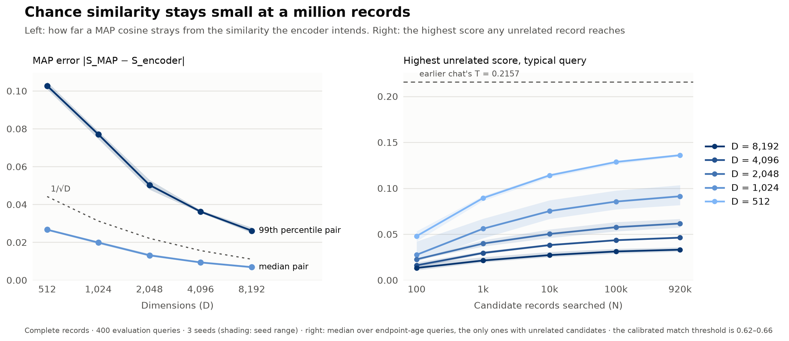
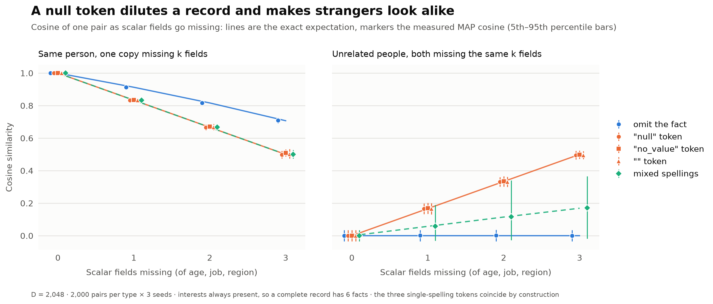
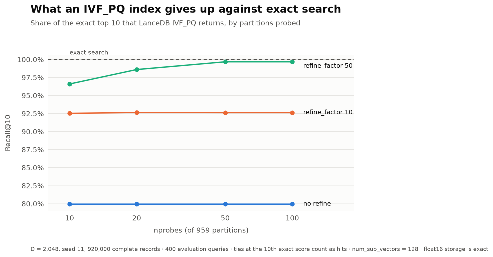

# What a bundle faces outside itself: a million neighbours and missing values

The [questionnaire study](../qa-encoding/REPORT.md) asked what fits **inside** one MAP bundle. This study asks what a bundle faces **outside** itself. A person's record has to be found among many other records, and some of its fields may have no value. That raises two questions: how sparsely filled can a record be before comparisons break down, and does it matter whether a missing value is written `"null"`, `"no_value"` or `""`? And how much chance similarity should we expect as the number of stored records grows?

We answer those questions with four experiments on one small, fully specified record type.

## The record we encode

Each synthetic `PERSON` has four fields:
- an **age band** (10 ordered levels)
- a **job category** (8)
- a **home region** (5)
- **three interests** out of 25

Every combination occurs exactly once, giving **920,000 records**. That is the whole state space, not a sample of people, so the records never repeat and we always know exactly how alike two of them are.

Each value is **bound** to its field's role vector using $\otimes$: $h_{\mathrm{fact}} = h_{\mathrm{role}} \otimes h_{\mathrm{value}}$. A record **bundles** those facts using $\oplus$: $h_{\mathrm{record}} = \bigoplus_{f \in \mathcal{F}} h_{\mathrm{fact},f}$, with six facts in $\mathcal{F}$ when complete. In this additive MAP encoder, binding is element-wise multiplication and bundling is an arithmetic sum without a sign threshold. Nearby age bands get overlapping vectors, so a 30-year-old looks more like a 35-year-old than a 65-year-old. We compare records by cosine.

Because the records are synthetic and exhaustive, every pair has two exact reference similarities:

- **Content similarity** counts only what both records actually know: the age overlap, a shared job, a shared region and shared interests. Two people who are both missing a field do *not* get credit for it.
- **Encoder similarity** is the cosine the encoding would produce with the intended age-level overlap and no accidental overlap between independent random atoms. It includes anything the null strategy itself adds.

That gives us a clean way to separate two effects. **MAP error** is the gap between the measured cosine and the encoder similarity; it is noise from using finite, random vectors. **Semantic shift** is the gap between the encoder and content similarities; it is similarity that a design choice added on purpose or by accident.

Code, settings and reproduction steps are in the [README](README.md) and [methodology](METHODOLOGY.md).

## 1. Among 920,000 records, chance similarity stays small

Imagine searching for one person among all 920,000 records. Most candidates share something with them: an age band nearby, a common job, an interest. That's genuine similarity, not an accident. The worry is the **unrelated** candidates, who share nothing at all: the opposite end of the age range, a different job and region, and no interests in common. Their cosine should be zero, but random vectors are never perfectly orthogonal, and the more candidates we search, the more chances one of them has to score high by luck.

We searched exactly, with no approximate index, from 400 query records against every one of the 920,000 candidates, at five dimensions and three random seeds, and recorded how the picture changes as the pool grows from 100 to 920,000.

**MAP error shrinks exactly as expected.** The 99th-percentile gap between the measured and intended cosine is **0.103 at 512 dimensions** and **0.026 at 8,192**. That's about 2.3/√D at every dimension, and it varies little between seeds.

**The unrelated tail grows slowly with N.** For a typical query, the best-scoring unrelated candidate reaches:

| Dimensions | 100 candidates | 920,000 candidates | Highest across all queries |
| --- | --- | --- | --- |
| 512 | 0.048 | 0.136 | 0.21 |
| 2,048 | 0.023 | 0.062 | 0.10 |
| 8,192 | 0.013 | 0.033 | 0.05 |

Each tenfold increase in candidates adds less than the one before. That's the signature of an extreme-value effect: more records don't mix together or "fill" the space; each query just gets more draws from the same noise distribution.

**No sensible threshold is ever crossed.** To decide what counts as a match, we calibrated a threshold T on a separate set of queries. T is set so that 99% of genuinely related pairs (at least two-thirds content similarity) score above it, and it is then held fixed. T sits between **0.62 and 0.66**, three times higher than the largest chance score we saw anywhere. Against it:
- related pairs were kept **99%** of the time on the evaluation queries (98.6–99.2% across seeds and dimensions)
- **no** unrelated candidate crossed T at any dimension, not even the earlier chat's much lower example threshold of 0.2157

Zero observed doesn't mean zero risk. Only the 160 queries at the extreme ages have unrelated candidates at all, so the honest bound is: with 95% confidence, fewer than **1.9%** of such queries would ever see a false match against 920,000 records.

**Ranking among genuinely similar records needs a bit more room than thresholds do.** At 920,000 candidates, 99.99% or more of each query's top ten belonged in the true top ten (100% from 1,024 dimensions up), and the top result was always the best available. Below that level, finite dimension does reorder near-ties: in each query's top 100, the share of pairs ranked the wrong way round is:
- 11.8% at 512 dimensions
- 0.6% at 2,048
- essentially none at 8,192

These are neighbours whose true similarities differ by one small step.

**Takeaway:** for a six-fact record, a million records is not a capacity problem. A few thousand dimensions keep chance similarity far below any useful match threshold. Dimension buys precise ordering among close neighbours, not safety from strangers.

## 2. A missing value: omit it, or write a token?

Now take the missing-value question directly. Suppose a Person record has fields with no value. There are really only two things an encoder can do:

- **Omit** the fact, so the record simply has fewer terms.
- Write a **token**: bind the field's role to a vector that stands for "no value". `"null"`, `"no_value"` and `""` are all tokens. To a hypervector encoder each is just another symbol, mapped to its own random vector.

We tested both on 2,000 pairs of each kind, removing zero to three of the scalar fields (age, job, region) while keeping interests present, so that a complete record always has six facts:

- **The same person, with one copy missing k fields.** How far does missingness *dilute* a record's similarity to itself?
- **Two unrelated people, both missing the same k fields.** Does shared missingness make strangers *look alike*?

We also tested **mixed spellings**, where each record's null is `"null"`, `"no_value"` or `""` at random, as happens when data arrives from different sources.

The measured cosines land on the curves the algebra predicts (lines), within MAP noise. At 2,048 dimensions:

| Missing fields | Same person, omit | Same person, token | Unrelated, omit | Unrelated, shared token | Unrelated, mixed spellings |
| --- | --- | --- | --- | --- | --- |
| 0 | 1.00 | 1.00 | 0.00 | 0.00 | 0.00 |
| 1 | 0.91 | 0.83 | 0.00 | 0.17 | 0.06 |
| 2 | 0.82 | 0.67 | 0.00 | 0.33 | 0.12 |
| 3 | 0.71 | 0.50 | 0.00 | 0.50 | 0.17 |

Four things follow.

1. **Every null spelling behaves the same.** `"null"`, `"no_value"` and `""` produced indistinguishable curves at every dimension. The spelling is not the decision; *whether you write a token at all* is.
2. **A shared token makes strangers look alike.** Two people with nothing in common, both missing three of six fields, score **0.50** with a shared token. That's the level of a genuinely half-similar pair, and it comes entirely from the shared "no value" symbol. With omission they stay at **0.00**.
3. **A token also dilutes more.** With one copy missing three fields, the same person scores 0.71 with omission (√(3/6), exactly the content similarity) but only 0.50 with a token. The token takes up space in the vector without matching anything.
4. **Mixed spellings don't fix it.** They cut the false similarity to about a third (0.17 at three fields), because two records only share a token when they happen to use the same spelling. The spread is wide, though: from −0.02 to 0.36 between the 5th and 95th percentiles. Some strangers now look noticeably alike and others don't, depending on which sources their data came from.

More dimensions don't change any of this. They narrow the MAP-noise spread (at three shared tokens, 0.47–0.56 at 512 dimensions against 0.49–0.52 at 8,192) but leave the 0.50 itself untouched, because it isn't noise.

**Takeaway:** **omit missing values.** Omission loses only the information that is actually missing. A null token adds similarity that no amount of dimension removes, and its spelling is irrelevant.

## 3. Does the token's effect survive into a million-record search?

A 0.5 cosine between two strangers sounds bad, but does it change what a search returns? We reran the million-record search with **30% of every field missing at random**, for queries and candidates alike, at 2,048 dimensions and three seeds. We compared omission with a shared `"null"` token, each with its own calibrated threshold. A missing interest set counts as a single token.

| At 2,048 dimensions, all 920,000 candidates | Complete records | 30% missing, omit | 30% missing, `"null"` token |
| --- | --- | --- | --- |
| Similarity added to unrelated pairs (mean) | 0 | 0 | **+0.092** |
| Highest unrelated score | 0.10 | 0.11 | **0.76** |
| Queries with an unrelated record above T | 0 of 160 | 0 of 399 | **20 of 399 (5.0%)** |
| Top-10 agreement with the content ranking | 100% | 99.1% | **67.9%** |
| Top result not the best available | 0% | 0% | **11.0%** |
| Top-10 agreement with the *encoder's own* ranking | 100% | 99.1% | 99.97% |
| Related pairs kept at T | 99.0% | 99.2% | 99.2% |

The 95% bootstrap intervals over queries are:
- queries with a false match under the token: **3.0–7.3%**
- top-10 agreement under the token: **64.5–71.3%**
- top result not the best available under the token: **8.0–14.2%**
- no false match under omission, with a 95% upper bound of 0.75% of queries

With omission, 30% missingness barely matters. Queries simply know less, and the search still returns records that really share what is known. With a token, one query in twenty finds a complete stranger above the match threshold. A third of each top ten is filled by records whose main resemblance is missing the same fields, and one query in nine gets the wrong top result.

The last comparison row shows why more dimensions won't fix this. Against the encoder's *own* notion of similarity, the token search is 99.97% accurate: MAP is faithfully retrieving exactly what it was told. The error is the instruction, not the noise. The token strategy even forces its threshold lower (0.58 against 0.65), because genuinely related records carrying tokens that don't match lose similarity too. That lower bar is part of how strangers get over it.

**Takeaway:** the pairwise effect is real at scale. A shared null token turns missing data into false matches and scrambled rankings; omission doesn't.

## 4. What an approximate index gives up

Exact search over 920,000 records is fine for a study but slow for an application. We indexed the 2,048-dimensional complete records with LanceDB's `IVF_PQ`, using √N partitions and 128 sub-vectors, and measured how much of the exact top ten it returns.

| nprobes (of 959) | No refinement | `refine_factor` 10 | `refine_factor` 50 |
| --- | --- | --- | --- |
| 10 | 80.0% | 92.5% | 96.6% |
| 20 | 80.0% | 92.7% | 98.6% |
| 50 | 80.0% | 92.6% | 99.7% |
| 100 | 80.0% | 92.6% | 99.7% |

**Probing more partitions doesn't help on its own.** Without refinement, recall is 80% whether the index probes 10 partitions or 100, and 99% of queries miss at least one of their exact top ten. So the partitions already contain the right neighbourhood. The loss comes from product quantization: PQ's compressed scores are off by **0.11** on average, and by up to 0.35. The exact top ten are near-ties (Experiment 1 showed they differ by one small step of similarity), so errors that size shuffle them.

**The misses are swaps, not mistakes.** In every setting, every record the index returned was still a genuinely related one (at least two-thirds content similarity), and no unrelated record crossed the match threshold. The index returns a different set of *equally good* neighbours, not wrong ones.

**Refinement recovers the exact answer.** `refine_factor` re-scores a larger candidate list with the stored full vectors. At refine 50 with 50 probes, recall is **99.7%**, and 97% of queries get their exact top ten. For context, the median query took about 4 ms without refinement and about 17 ms with probes 50 and refine 50. That was a single-threaded Python loop, not a tuned benchmark.

**Takeaway:** IVF_PQ is safe here for "find me people like this" on its own. When the exact ordering among close neighbours matters, add refinement (`refine_factor` ≈ 50). Probing more partitions without refinement buys nothing.

## What we learned

| Experiment | What we found | What it suggests |
| --- | --- | --- |
| 1. Chance similarity at scale | Among 920,000 records, the highest score an unrelated record reached was 0.21 at 512 dimensions and 0.05 at 8,192, against match thresholds of 0.62–0.66. No false matches at any dimension; related-pair recall 99%. Wrong-order pairs among close neighbours fell from 12% to about 0 between 512 and 8,192 dimensions. | For a record of about six facts, a million records is not a capacity limit. Choose D for how precisely close neighbours must be ordered. |
| 2. One comparison with missing fields | `"null"`, `"no_value"` and `""` behave identically. A shared token makes two strangers missing half their fields score 0.50; omission keeps them at 0.00 and dilutes a sparse copy less (0.71 vs 0.50). | Omit missing values. The spelling of a null is irrelevant; writing one at all is the mistake. |
| 3. Missing fields in a million-record search | With 30% missing, a shared `"null"` token gave 5% of queries a false match and cut top-10 agreement to 68%; omission gave no false matches and 99% agreement. | The pairwise false similarity becomes wrong search results. Dimension can't remove it, because it isn't noise. |
| 4. IVF_PQ against exact search | Without refinement, 80% of the exact top ten come back at any nprobes; every returned record is still related, and none is a false match. `refine_factor` 50 lifts recall to 99.7%. | The loss is PQ's score approximation reshuffling near-ties, not missed partitions. Use refinement when exact order matters. |

## Reproducing this

`sh src/scale-missingness/reproduce.sh` regenerates the fixture, runs the tests and all four experiments, and redraws the figures. It took **under 7 minutes** on a 10-core Apple M5. LanceDB stores every random vector as float16, which is exact here because bundles are small integers, and one 920,000-record table for the index: **3.6 GB** in total. Every other vector is rebuilt from the stored atoms on the fly.

## Limits

- **The fixture is synthetic.** It is a controlled factorial state space with a six-fact record, not real people. Real records with more fields, skewed values or near-duplicates will have different tails.
- **The results are query-level, not all-pairs.** 400 queries against 920,000 candidates is a small part of the 4.2 × 10¹¹ possible pairs, so the bounds above apply per query.
- **The scale is empirical only.** How these tails extend to billions of records is Phase 2 of HYP-83. The earlier chat's majority-sign formula does not describe this additive encoder, as explained in the [methodology](METHODOLOGY.md#applicability-of-the-earlier-chats-model).
