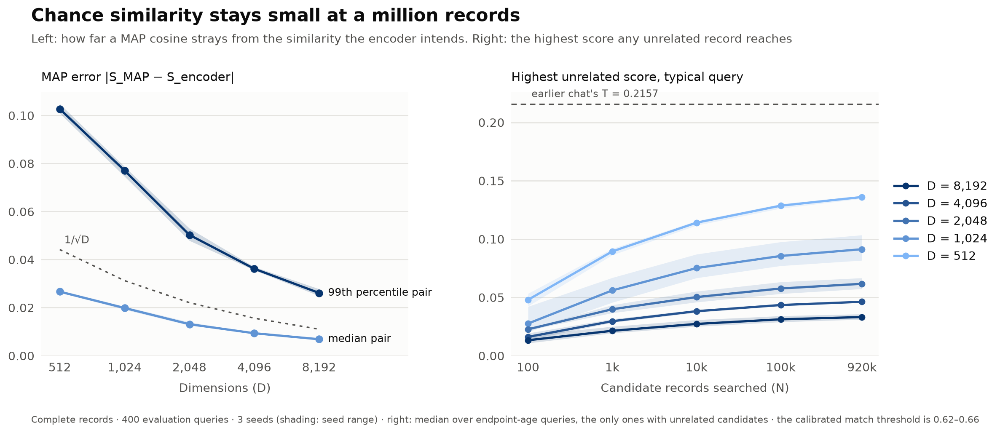
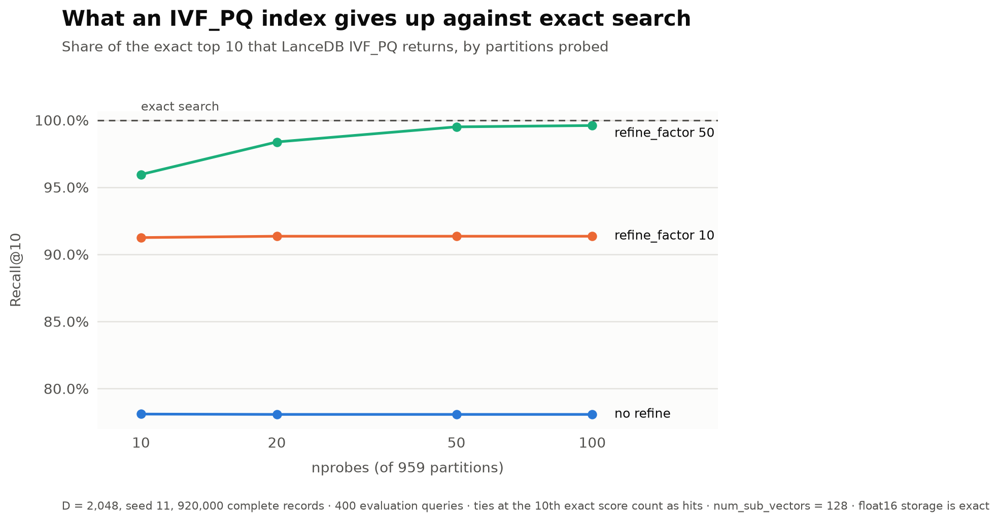

# What a bundle faces outside itself: a million neighbours

The [questionnaire study](../qa-encoding/REPORT.md) asked what fits **inside** one MAP bundle. This study asks what a bundle faces **outside** itself. A person's record has to be found among many other records, and every extra record is another chance for a stranger to score high by accident. How much chance similarity should we expect as the number of stored records grows, how does the dimension control it, and what does an approximate index give up on top?

We answer those questions with two experiments on one small, fully specified record type. Missing values are a different question, about how a record is normalized rather than how many records there are, so they get their own post ([HYP-118](https://linear.app/hyperdimensionalcomputing/issue/HYP-118/research-blog-how-to-handle-missing-data-via-normalization)).

## The record we encode

Each synthetic `PERSON` has four fields:
- an **age band** (10 ordered levels)
- a **job category** (8)
- a **home region** (5)
- **three interests** out of 25

Every combination occurs exactly once, giving **920,000 records**. That is the whole state space, not a sample of people, so the records never repeat and we always know exactly how alike two of them are.

Each value is **bound** to its field's role vector using $\otimes$: $h_{\mathrm{fact}} = h_{\mathrm{role}} \otimes h_{\mathrm{value}}$. A record **bundles** those facts using $\oplus$: $h_{\mathrm{record}} = \bigoplus_{f \in \mathcal{F}} h_{\mathrm{fact},f}$, with six facts in $\mathcal{F}$. In this additive MAP encoder, binding is element-wise multiplication and bundling is an arithmetic sum without a sign threshold. Nearby age bands get overlapping vectors, so a 30-year-old looks more like a 35-year-old than a 65-year-old. We compare records by cosine.

Because the records are synthetic and exhaustive, every pair has an exact reference: the **exact similarity**, the cosine the encoding would produce with the intended age-level overlap and no accidental overlap between independent random atoms. It counts the age overlap, a shared job, a shared region and shared interests, out of six facts. **MAP error** is the gap between the measured cosine and the exact similarity: noise from using finite, random vectors.

Code, settings and reproduction steps are in the [README](README.md) and [methodology](METHODOLOGY.md).

## 1. Among 920,000 records, chance similarity stays small

Imagine searching for one person among all 920,000 records. Most candidates share something with them: an age band nearby, a common job, an interest. That's genuine similarity, not an accident. The worry is the **unrelated** candidates, who share nothing at all: the opposite end of the age range, a different job and region, and no interests in common. Their cosine should be zero, but random vectors are never perfectly orthogonal, and the more candidates we search, the more chances one of them has to score high by luck.

We searched exactly, with no approximate index, from 400 query records against every one of the 920,000 candidates, at five dimensions and three random seeds, and recorded how the picture changes as the pool grows from 100 to 920,000.

**MAP error shrinks exactly as expected.** The 99th-percentile gap between the measured and intended cosine is **0.103 at 512 dimensions** and **0.026 at 8,192**. That's about 2.3/√D at every dimension, and it varies little between seeds.

**The unrelated tail grows slowly with N.** For a typical query, the best-scoring unrelated candidate reaches:

| Dimensions | 100 candidates | 920,000 candidates | Highest across all queries |
| --- | --- | --- | --- |
| 512 | 0.048 | 0.136 | 0.21 |
| 2,048 | 0.023 | 0.062 | 0.10 |
| 8,192 | 0.013 | 0.033 | 0.05 |

Each tenfold increase in candidates adds less than the one before. That's the signature of an extreme-value effect: more records don't mix together or "fill" the space; each query just gets more draws from the same noise distribution.

**No sensible threshold is ever crossed.** To decide what counts as a match, we calibrated a threshold T on a separate set of queries. T is set so that 99% of genuinely related pairs (at least two-thirds exact similarity) score above it, and it is then held fixed. T sits between **0.62 and 0.66**, three times higher than the largest chance score we saw anywhere. Against it:
- related pairs were kept **99%** of the time on the evaluation queries (98.6–99.2% across seeds and dimensions)
- **no** unrelated candidate crossed T at any dimension, not even the earlier chat's much lower example threshold of 0.2157

Zero observed doesn't mean zero risk. Only the 160 queries at the extreme ages have unrelated candidates at all, so the honest bound is: with 95% confidence, fewer than **1.9%** of such queries would ever see a false match against 920,000 records.

**Ranking among genuinely similar records needs a bit more room than thresholds do.** At 920,000 candidates, 99.99% or more of each query's top ten belonged in the true top ten (100% from 1,024 dimensions up), and the top result was always the best available. Below that level, finite dimension does reorder near-ties: in each query's top 100, the share of pairs ranked the wrong way round is:
- 11.8% at 512 dimensions
- 0.6% at 2,048
- essentially none at 8,192

These are neighbours whose true similarities differ by one small step.

**Takeaway:** for a six-fact record, a million records is not a capacity problem. A few thousand dimensions keep chance similarity far below any useful match threshold. Dimension buys precise ordering among close neighbours, not safety from strangers.

## 2. What an approximate index gives up

Exact search over 920,000 records is fine for a study but slow for an application. We indexed the 2,048-dimensional complete records with LanceDB's `IVF_PQ`, using √N partitions and 128 sub-vectors, and measured how much of the exact top ten it returns.

| nprobes (of 959) | No refinement | `refine_factor` 10 | `refine_factor` 50 |
| --- | --- | --- | --- |
| 10 | 78.1% | 91.3% | 96.0% |
| 20 | 78.1% | 91.4% | 98.4% |
| 50 | 78.1% | 91.4% | 99.5% |
| 100 | 78.1% | 91.4% | 99.6% |

**Probing more partitions doesn't help on its own.** Without refinement, recall is 78% whether the index probes 10 partitions or 100, and 399 of 400 queries miss at least one of their exact top ten. So the partitions already contain the right neighbourhood. The loss comes from product quantization: PQ's compressed scores are off by **0.12** on average, and by up to 0.37. The exact top ten are near-ties (Experiment 1 showed they differ by one small step of similarity), so errors that size shuffle them.

**The misses are swaps, not mistakes.** In every setting, every record the index returned was still a genuinely related one (at least two-thirds exact similarity), and no unrelated record crossed the match threshold. The index returns a different set of *equally good* neighbours, not wrong ones.

**Refinement recovers the exact answer.** `refine_factor` re-scores a larger candidate list with the stored full vectors. At refine 50 with 50 probes, recall is **99.5%**, and 96% of queries get their exact top ten. For context, the median query took about 4 ms without refinement and about 16 ms with probes 50 and refine 50. That was a single-threaded Python loop, not a tuned benchmark.

**Takeaway:** IVF_PQ is safe here for "find me people like this" on its own. When the exact ordering among close neighbours matters, add refinement (`refine_factor` ≈ 50). Probing more partitions without refinement buys nothing.

## What we learned

| Experiment | What we found | What it suggests |
| --- | --- | --- |
| 1. Chance similarity at scale | Among 920,000 records, the highest score an unrelated record reached was 0.21 at 512 dimensions and 0.05 at 8,192, against match thresholds of 0.62–0.66. No false matches at any dimension; related-pair recall 99%. Wrong-order pairs among close neighbours fell from 12% to about 0 between 512 and 8,192 dimensions. | For a record of about six facts, a million records is not a capacity limit. Choose D for how precisely close neighbours must be ordered. |
| 2. IVF_PQ against exact search | Without refinement, 78% of the exact top ten come back at any nprobes; every returned record is still related, and none is a false match. `refine_factor` 50 lifts recall to 99.5–99.6%. | The loss is PQ's score approximation reshuffling near-ties, not missed partitions. Use refinement when exact order matters. |

## Reproducing this

`sh src/scale/reproduce.sh` regenerates the fixture, runs the tests and both experiments, and redraws the figures. It took about **6 minutes** on a 10-core Apple M5. LanceDB stores every random vector as float16, which is exact here because bundles are small integers, and one 920,000-record table for the index: **3.6 GB** in total. Every other vector is rebuilt from the stored atoms on the fly.

## Limits

- **The fixture is synthetic.** It is a controlled factorial state space with a six-fact record, not real people. Real records with more fields, skewed values or near-duplicates will have different tails.
- **The results are query-level, not all-pairs.** 400 queries against 920,000 candidates is a small part of the 4.2 × 10¹¹ possible pairs, so the bounds above apply per query.
- **The scale is empirical only.** How these tails extend to billions of records is Phase 2 of HYP-83. The earlier chat's majority-sign formula does not describe this additive encoder, as explained in the [methodology](METHODOLOGY.md#applicability-of-the-earlier-chats-model).
