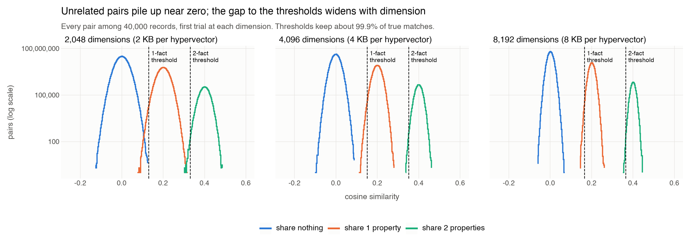
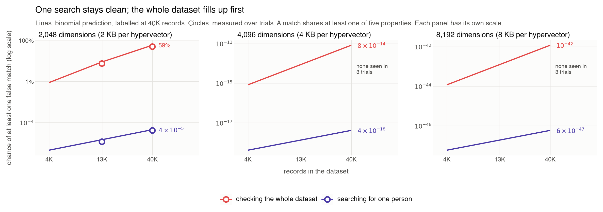

# How many records fit before chance looks like a match?

Each record is a hypervector that bundles five facts. Two records that share a fact should score higher than two that share nothing, but unrelated records also score a little above or below zero by chance. This study asks how often chance alone crosses a match threshold, for the two jobs a practitioner actually does:

- **Searching for one person** compares one record with the other N − 1. Its risk grows with N.
- **Checking the whole dataset** (deduplication, clustering, building a similarity graph) compares every pair, about N²/2 of them. Its risk grows with N², so it runs out first. This is the birthday paradox: a match for *you* is rare, a match between *any two* people is common.

The [methodology](METHODOLOGY.md) gives the design; this report is regenerated by `run.py`.

## Setup

- **Records.** The first 4,000, 13,000 and 40,000 of 40,000 synthetic records with five independent, uniformly drawn properties: region (20 values), education (10), occupation (100), interest cluster (200) and employer (1,000). 84.1% of pairs share no property.
- **Encoder.** Each fact is a role hypervector bound to a value hypervector (both random ±1). A record is the raw sum of its five facts, with no sign step, so every fact can still be unbound. Stored as int8, a record hypervector takes D bytes.
- **Score.** Cosine similarity between two records.
- **Matches and thresholds.** A pair sharing q properties averages q/5. Each threshold sits 3.09 spreads below that average, T = q/5 − 3.09/√D, to keep about 99.9% of true matches.
- **Trials.** Every record is compared with every other once, with fresh hypervectors per trial: 40 at D = 2,048, 3 at D = 4,096, 3 at D = 8,192. All trials took 377 seconds on one laptop CPU.

## Theory in four steps

1. A pair sharing q of 5 properties scores about **q/5** on average.
2. Put the threshold at **T = q/5 − 3.09/√D**, so about 99.9% of those pairs score above it.
3. An unrelated pair crosses T by chance with probability **p(T)**, from the binomial model: count agreeing coordinates as coin flips. The model is exact for ±1 records; for raw sums it has the right average (0) and spread (1/√D).
4. Expected false matches = **comparisons × p(T)**. One search makes about N comparisons; the whole dataset makes about N²/2.

## Results: one-fact matches

| D | Records | Pairs | 1-fact threshold | Highest unrelated score (mean of trials) | Expected false pairs | Measured false pairs (mean) | Dataset with a false match: predicted / measured | One search with a false match: predicted / measured |
|---:|---:|---:|---:|---:|---:|---:|---|---|
| 2,048 | 4,000 | 7,998,000 | 0.132 | 0.115 | 0.0089 | 0.00 | 0.9% / 0 | 4.4 × 10^-06 / 0 |
| 2,048 | 13,000 | 84,493,500 | 0.132 | 0.124 | 0.094 | 0.07 | 9.0% / 7.5% | 1.4 × 10^-05 / 1.2 × 10^-05 |
| 2,048 | 40,000 | 799,980,000 | 0.132 | 0.132 | 0.89 | 0.82 | 58.9% / 50.0% | 4.4 × 10^-05 / 4.1 × 10^-05 |
| 4,096 | 4,000 | 7,998,000 | 0.152 | 0.082 | 8.2e-16 | 0.00 | 8.2 × 10^-16 / 0 | 4.1 × 10^-19 / 0 |
| 4,096 | 13,000 | 84,493,500 | 0.152 | 0.085 | 8.7e-15 | 0.00 | 8.7 × 10^-15 / 0 | 1.3 × 10^-18 / 0 |
| 4,096 | 40,000 | 799,980,000 | 0.152 | 0.094 | 8.2e-14 | 0.00 | 8.2 × 10^-14 / 0 | 4.1 × 10^-18 / 0 |
| 8,192 | 4,000 | 7,998,000 | 0.166 | 0.058 | 1.2e-44 | 0.00 | 1.2 × 10^-44 / 0 | 5.8 × 10^-48 / 0 |
| 8,192 | 13,000 | 84,493,500 | 0.166 | 0.064 | 1.2e-43 | 0.00 | 1.2 × 10^-43 / 0 | 1.9 × 10^-47 / 0 |
| 8,192 | 40,000 | 799,980,000 | 0.166 | 0.067 | 1.2e-42 | 0.00 | 1.2 × 10^-42 / 0 | 5.8 × 10^-47 / 0 |

At D = 2,048 and 40,000 records, theory expects 0.89 false pairs in the dataset, a 58.9% chance of at least one. The measured chance over 40 trials is 50.0%. The chance that one person's search returns a false match is 4.4 × 10^-05 predicted and 4.1 × 10^-05 measured. At D = 4,096 and 8,192, no false match occurred in any trial, as predicted.

With two-fact matches, 0 false pairs occurred across every setting and trial.

## Results: missed matches

| D | 1-fact threshold | Misses among pairs sharing 1+ | 2-fact threshold | Misses among pairs sharing 2+ |
|---:|---:|---:|---:|---:|
| 2,048 | 0.132 | 0.048% | 0.332 | 0.007% |
| 4,096 | 0.152 | 0.055% | 0.352 | 0.007% |
| 8,192 | 0.166 | 0.043% | 0.366 | 0.006% |

The thresholds use 1/√D as the spread for every group. Pairs that share facts spread a little less, so the measured miss rates sit below the 0.1% target.

## What the formula says at scale

The measurements check the formula where its predictions are small enough to test. The same formula gives the record counts that keep the chance of any false match at or below 1%:

| D | Storage per hypervector | Match means | One search: records within a 1% risk | Whole dataset: records within a 1% risk |
|---:|---:|---|---:|---:|
| 2,048 | 2 KB | sharing 1+ of 5 | 8,999,868 | 4,243 |
| 2,048 | 2 KB | sharing 2+ of 5 | 3.0 × 10^49 | 7.7 × 10^24 |
| 4,096 | 4 KB | sharing 1+ of 5 | 9.8 × 10^19 | 1.4 × 10^10 |
| 4,096 | 4 KB | sharing 2+ of 5 | 2.0 × 10^112 | 2.0 × 10^56 |
| 8,192 | 8 KB | sharing 1+ of 5 | 6.8 × 10^48 | 3.7 × 10^24 |
| 8,192 | 8 KB | sharing 2+ of 5 | 5.0 × 10^243 | 1.0 × 10^122 |

These are formula outputs, not measurements. They assume independent, uniformly drawn properties and the binomial tail; skewed or correlated real data shifts them.

## Conditions and limits

The results describe five independent, uniformly distributed categorical properties, raw-sum bundling of exactly five facts, exact cosine and the binomial tail model. Real records have popular values and correlated properties, which create genuine overlaps and change how many pairs are unrelated. An application still needs its own definition of a match.

## Files

All in `results/scale/`: `trials.csv` (one row per dimension, trial and size), `summary.csv` (measured and predicted per dimension and size), `score_histograms.csv`, `figure1_scores.png/.svg`, `figure2_false_matches.png/.svg` and `manifest.json`. Regenerate everything with `sh src/scale/reproduce.sh` from the repository root.

