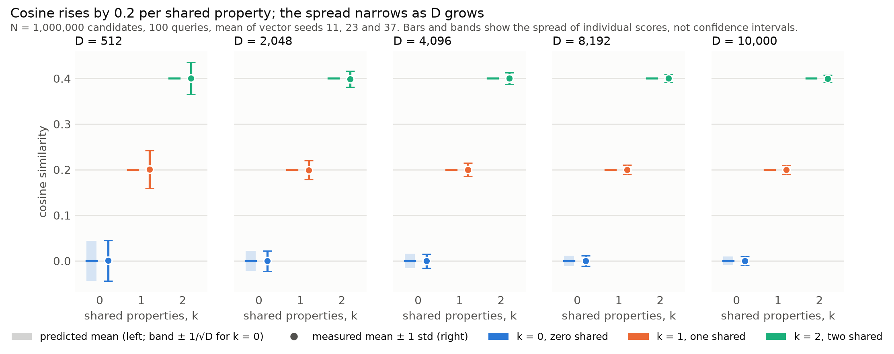
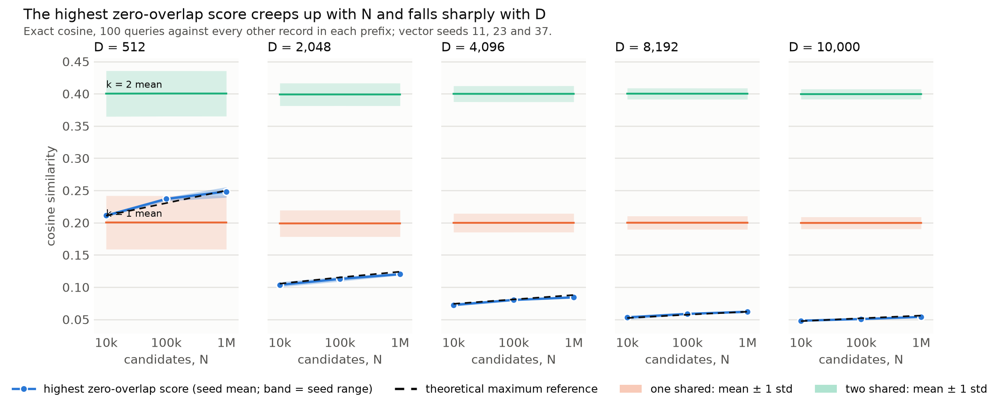

# Bundled categorical records at scale

This report covers the scale study described in the [methodology](METHODOLOGY.md): exact cosine comparisons between records that bundle five categorical properties as a raw sum, against populations of up to one million records, at five hypervector dimensions. All values are rounded to three decimals; comparison counts are whole numbers.

## In brief

A hypervector record can be compared with a million others by cosine similarity. Two records that share nothing still score a little above or below zero by chance, and with enough candidates, one of those chance scores gets surprisingly high. This study measured how high, and whether it can be confused with the score of a record that genuinely shares one or two properties. Theory predicted the answers almost exactly. Each shared property adds about 0.200 to the cosine. Chance scores scatter by about 1/√D. The highest chance score among 84,133,994 comparisons sits about 5.489 of those spreads above zero. At D = 512 that is 0.248, more than one shared property is worth. From D = 2,048 it stays clearly below.

## Background for readers new to hypervectors

- **Hypervectors.** A hypervector is a long list of D numbers. Every role and value hypervector here has entries of +1 or −1, chosen at random. Two independent random hypervectors are almost orthogonal: their cosine similarity is close to 0, scattering by about 1/√D (0.044 at D = 512, 0.010 at D = 10,000). That scatter is the noise floor of everything below.
- **Binding ($\otimes$).** Element-wise multiplication. Binding a property's role vector (say, "employer") with a value vector (say, employer no. 412) gives a new random-looking vector, a *fact*, unrelated to either input and to facts about other properties. Two records with the same employer produce the identical employer fact.
- **Bundling ($\oplus$).** Adds the five facts coordinate by coordinate into one record vector of the same length. No sign is applied, so each coordinate is −5, −3, −1, 1, 3 or 5, and any fact can still be unbound from the record.
- **Cosine similarity.** The dot product of two records divided by the product of their lengths: 1 for identical records, about 0 for unrelated ones.
- **Why one shared fact is worth 0.200.** Multiplying two records coordinate by coordinate, a shared fact meets itself and contributes +1; every other product pairs unrelated terms and averages 0. The dot product is therefore about D per shared fact, and each record's length is about √(5D). One shared fact gives D / 5D = 1/5; k shared facts give k/5.
- **Why more candidates mean higher chance scores.** Each zero-overlap comparison is one random draw from a narrow bell curve around 0. The more draws, the further the most extreme one reaches into the tail. That tail thins very fast, so the maximum grows only with the square root of the logarithm of the number of comparisons.

## What a practitioner can expect

These rules of thumb hold under the measured conditions: five uniformly drawn categorical properties, one raw-sum bundle per record, exact cosine.

1. **Each shared property is worth 0.200 cosine.** Records sharing zero, one, two or three properties score 0.000, 0.200, 0.400 and 0.600 on average, at every D and N tested. The measured means match these predictions to within 0.001.
2. **D sets the noise; N does not.** The spread of individual scores is about 1/√D: 0.044 at D = 512 and 0.010 at D = 10,000. Adding candidates only adds more draws from the same distribution.
3. **The highest zero-overlap score rises slowly with N.** From 10,000 to 1,000,000 candidates (100 times as many), it rose from 0.211 to 0.248 at D = 512, and from 0.048 to 0.054 at D = 10,000. At a million candidates it sat 5.390–5.620 standard deviations above zero.
4. **At D = 512, a million candidates are too many to keep chance scores below one shared property.** The highest zero-overlap score (0.248) exceeds the typical one-shared score (0.200). From D = 2,048 it sits at least 3.830 one-shared standard deviations below the one-shared mean.
5. **The binomial model predicts the extremes well enough to size D in advance.** Across every D and N, the measured maximum stayed within 0.006 of the theoretical reference.
6. **Gains taper beyond 8,192 dimensions.** Moving to 10,000 dimensions narrowed the zero-overlap spread by 10.6% (predicted 9.5%) and lowered the highest zero-overlap score from 0.062 to 0.054.

None of this sets a match threshold. Whether one shared property counts as relevant is an application decision; the study measures how faithfully cosine reports the number of shared properties.

## Setup

- **Records.** 1,000,000 synthetic records with five independent, uniformly drawn properties: region (20 values), education (10), occupation (100), interest cluster (200) and employer (1,000). Data seed 101. The sequence contains 132 duplicate attribute records.
- **Encoder.** Each property has a random bipolar role vector and each value a random bipolar value vector. A record is the coordinate-wise sum of its five bound facts, with no sign applied, $h_{\mathrm{record}} = h_{\mathrm{fact},1} \oplus \cdots \oplus h_{\mathrm{fact},5}$ with $h_{\mathrm{fact},i} = h_{\mathrm{role},i} \otimes h_{\mathrm{value},i}$.
- **Comparisons.** The first 100 records are queries. Each is compared, by exact cosine, with every other record in nested prefixes N = 10,000, 100,000 and 1,000,000. That makes 99,999,900 directed comparisons at the largest prefix for each D and vector seed. A query's own record is excluded.
- **Grid.** D = 512, 2,048, 4,096, 8,192 and 10,000; vector seeds 11, 23 and 37. Each (D, seed) is one pass through the million records. The 15 passes took 91 seconds in total on one laptop CPU.
- **Groups.** Pairs are grouped by k, the number of properties with identical values, from the categorical records alone. At N = 1,000,000 the panel has 84,133,994 comparisons with k = 0, 15,137,069 with k = 1, 719,912 with k = 2, 8,887 with k = 3, 38 with k = 4 and 0 with k = 5. None of the 100 queries happens to have a duplicate attribute record. These counts are the same for every D and seed.

### Terms used in this report

- **k, shared properties.** The number of properties on which two records have identical values, counted from the raw categorical records before any encoding. Groups are called *zero shared* (k = 0, also *zero-overlap*), *one shared* (k = 1) and *two shared* (k = 2).
- **Predicted mean and spread.** $\mu_k = k/5$, and for zero overlap $\sigma_0 = 1/\sqrt{D}$, the standard deviation of a single score under the ideal model of independent random vectors. Spreads for shared properties are measured, not predicted.
- **Measured mean and spread.** Pooled over every comparison in a group (all 100 queries), per vector seed, then averaged over the three seeds. "Std" always means the spread of individual scores, never an uncertainty of the mean.
- **Highest zero-overlap score.** The single largest cosine among all zero-overlap comparisons for the whole query panel at a given N, D and seed.
- **Maximum reference.** The cosine that an ideal model expects about one zero-overlap comparison in M₀ to reach. It is a reference level for the maximum, not a bound.
- **Exceedances.** How many zero-overlap comparisons reach a fixed score level, compared with the number the binomial model expects.
- **Vector seed.** Selects one random set of role and value vectors. Different seeds are different, equally valid encoders of the same records.

## Part 1: cosine reflects the number of shared properties

**Figure 1.** Mean cosine for zero, one and two shared properties at N = 1,000,000, one panel per D. Each predicted mean is a tick with a band of ± one predicted standard deviation. Each measured mean is a dot with bars of ± the measured standard deviation, averaged over seeds. Bars and bands show the spread of individual scores, not confidence intervals.

| D | k | Comparisons | Predicted mean | Measured mean (seed range) | Predicted std | Measured std (seed range) | Highest score (seed range) | Maximum reference |
|---:|---:|---:|---:|---|---:|---|---|---:|
| 512 | 0 | 84,133,994 | 0.000 | 0.001 (0.000–0.002) | 0.044 | 0.044 (0.044–0.045) | 0.248 (0.239–0.255) | 0.250 |
| 512 | 1 | 15,137,069 | 0.200 | 0.200 (0.199–0.202) | — | 0.041 (0.041–0.042) | — | — |
| 512 | 2 | 719,912 | 0.400 | 0.400 (0.398–0.403) | — | 0.035 (0.035–0.036) | — | — |
| 2,048 | 0 | 84,133,994 | 0.000 | 0.000 (−0.001 to 0.001) | 0.022 | 0.022 (0.022–0.022) | 0.120 (0.118–0.122) | 0.124 |
| 2,048 | 1 | 15,137,069 | 0.200 | 0.199 (0.198–0.200) | — | 0.021 (0.020–0.021) | — | — |
| 2,048 | 2 | 719,912 | 0.400 | 0.399 (0.397–0.401) | — | 0.018 (0.017–0.018) | — | — |
| 4,096 | 0 | 84,133,994 | 0.000 | 0.000 (−0.001 to 0.000) | 0.016 | 0.016 (0.015–0.016) | 0.084 (0.083–0.086) | 0.088 |
| 4,096 | 1 | 15,137,069 | 0.200 | 0.200 (0.199–0.201) | — | 0.014 (0.014–0.015) | — | — |
| 4,096 | 2 | 719,912 | 0.400 | 0.400 (0.399–0.401) | — | 0.012 (0.012–0.013) | — | — |
| 8,192 | 0 | 84,133,994 | 0.000 | 0.000 (0.000–0.000) | 0.011 | 0.011 (0.011–0.011) | 0.062 (0.061–0.063) | 0.062 |
| 8,192 | 1 | 15,137,069 | 0.200 | 0.200 (0.200–0.200) | — | 0.010 (0.010–0.010) | — | — |
| 8,192 | 2 | 719,912 | 0.400 | 0.400 (0.400–0.400) | — | 0.009 (0.009–0.009) | — | — |
| 10,000 | 0 | 84,133,994 | 0.000 | 0.000 (0.000–0.000) | 0.010 | 0.010 (0.010–0.010) | 0.054 (0.053–0.056) | 0.056 |
| 10,000 | 1 | 15,137,069 | 0.200 | 0.200 (0.200–0.200) | — | 0.009 (0.009–0.009) | — | — |
| 10,000 | 2 | 719,912 | 0.400 | 0.399 (0.399–0.400) | — | 0.008 (0.008–0.008) | — | — |

**Table 1.** N = 1,000,000; seed averages, with the range over vector seeds 11, 23 and 37 in parentheses. The comparison counts are identical across D and seeds.

The measured means differ from k/5 by at most 0.001. The zero-overlap standard deviations are 0.997–1.010 times 1/√D; shared facts narrow the spread a little, because shared terms always contribute the same +1. The ladder of means does not depend on D; increasing D only narrows each group. Growing N from 10,000 to 1,000,000 leaves the means and spreads unchanged to three decimals, as expected. The saved summaries also hold k = 3 and k = 4, whose measured means (0.600 and 0.800 at D = 10,000) agree with 0.600 and 0.800. Only 38 comparisons have k = 4, so its spread is noisy.

## Part 2: how high zero-overlap similarity gets

**Figure 2.** The highest zero-overlap cosine across the 100-query panel at each N, one panel per D. Dots are seed means and the dark band is the seed range. The dashed line is the theoretical maximum reference for the actual number of zero-overlap comparisons. The shaded bands are the measured one-shared and two-shared means ± one standard deviation.

| D | Zero-overlap comparisons | Maximum reference | Highest zero-overlap score (seed range) | k = 1 mean − 1 std | k = 1 mean | Gap below the k = 1 mean, in k = 1 stds |
|---:|---:|---:|---|---:|---:|---:|
| 512 | 84,133,994 | 0.250 | 0.248 (0.239–0.255) | 0.159 | 0.200 | -1.158 |
| 2,048 | 84,133,994 | 0.124 | 0.120 (0.118–0.122) | 0.178 | 0.199 | 3.830 |
| 4,096 | 84,133,994 | 0.088 | 0.084 (0.083–0.086) | 0.185 | 0.200 | 7.974 |
| 8,192 | 84,133,994 | 0.062 | 0.062 (0.061–0.063) | 0.190 | 0.200 | 13.364 |
| 10,000 | 84,133,994 | 0.056 | 0.054 (0.053–0.056) | 0.190 | 0.200 | 15.696 |

**Table 2.** N = 1,000,000; seed averages. The gap column is (k = 1 mean − highest zero-overlap score) / k = 1 standard deviation; a negative gap means the highest zero-overlap score lies above the one-shared mean.

At each D, the highest zero-overlap score:

- **D = 512:** exceeds the typical one-shared score.
- **D = 2,048:** stays below the one-shared band.
- **D = 4,096:** stays below the one-shared band.
- **D = 8,192:** stays below the one-shared band.
- **D = 10,000:** stays below the one-shared band.

Beating a group's mean is a comparison with a typical score. It does not mean every record in that group was outranked. This study does not rank results, and it does not label one shared property a false match.

How the highest zero-overlap score grows with N (seed means, with the theoretical reference):

| D | N = 10,000 | N = 100,000 | N = 1,000,000 |
|---:|---|---|---|
| 512 | 0.211 (reference 0.211) | 0.237 (reference 0.230) | 0.248 (reference 0.250) |
| 2,048 | 0.104 (reference 0.105) | 0.113 (reference 0.115) | 0.120 (reference 0.124) |
| 4,096 | 0.072 (reference 0.074) | 0.080 (reference 0.081) | 0.084 (reference 0.088) |
| 8,192 | 0.053 (reference 0.052) | 0.059 (reference 0.057) | 0.062 (reference 0.062) |
| 10,000 | 0.048 (reference 0.047) | 0.051 (reference 0.052) | 0.054 (reference 0.056) |

The maximum reference is the smallest attainable cosine whose ideal tail probability is at most 1/M₀, where M₀ is the number of zero-overlap comparisons. Every measured maximum lies within 0.006 of it. Multiplying the comparisons by 100 raises the reference by 0.039 at D = 512, 0.019 at D = 2,048, 0.014 at D = 4,096, 0.010 at D = 8,192, 0.009 at D = 10,000.

### A back-of-envelope sizing rule

The normal approximation gives a rule simple enough to quote. The highest of M₀ near-independent chance scores sits about √(2 ln M₀) noise spreads above zero, where one spread is 1/√D. With M₀ = 84,133,994, that is 6.041 spreads. The one-shared mean sits μ₁√D spreads above zero, so the gap between them, in spreads, is roughly μ₁√D − √(2 ln M₀):

| D | μ₁√D | Rule-of-thumb gap, μ₁√D − √(2 ln M₀) | Measured gap (Table 2) |
|---:|---:|---:|---:|
| 512 | 4.525 | -1.516 | -1.158 |
| 2,048 | 9.051 | 3.010 | 3.830 |
| 4,096 | 12.800 | 6.759 | 7.974 |
| 8,192 | 18.102 | 12.061 | 13.364 |
| 10,000 | 20.000 | 13.959 | 15.696 |

**Table 4.** The rule against the measured gap from Table 2. The rule is slightly pessimistic, mainly because the √(2 ln M) approximation overshoots the expected maximum of a normal sample at this M₀.

Solving for D: the highest chance score reaches the one-shared mean at D ≈ (√(2 ln M₀)/μ₁)² ≈ 912. It sits three spreads below that mean at D ≈ ((√(2 ln M₀) + 3)/μ₁)² ≈ 2,044. Both are consistent with the measurements: at D = 512 the measured maximum is above the one-shared mean, and at D = 2,048 it sits 3.830 one-shared spreads below it. Because √(2 ln M) grows so slowly, a hundred times more comparisons raise it by only about 15.7% here. The measured maximum rose by 12.2–17.7% across D, between N = 10,000 and N = 1,000,000. The rule describes this fixture's five facts and uniform values; it is not a capacity estimate for other populations.

### Expected exceedances

Expected exceedance counts test the tail directly, without assuming independent comparisons. The table counts the zero-overlap comparisons at N = 1,000,000 scoring at least half the one-shared mean (0.100) and at least the one-shared mean (0.200). These are fixed score levels, not match thresholds.

| D | Expected ≥ 0.100 | Measured ≥ 0.100 (seed range) | Expected ≥ 0.200 | Measured ≥ 0.200 (seed range) |
|---:|---:|---|---:|---|
| 512 | 1,014,149 | 1,057,178 (982,244–1,136,981) | 208 | 286 (271–297) |
| 2,048 | 244 | 245 (162–350) | <0.001 | 0 (0–0) |
| 4,096 | 0.007 | 0 (0–0) | <0.001 | 0 (0–0) |
| 8,192 | <0.001 | 0 (0–0) | <0.001 | 0 (0–0) |
| 10,000 | <0.001 | 0 (0–0) | <0.001 | 0 (0–0) |

**Table 3.** Expected counts are $M_0\,p_0(s)$ from the binomial survival probability. Measured counts are seed means, with seed ranges.

Where the expected count is at least one, the measured count is 1.042 times the expectation at 0.100 for D = 512; 1.375 times the expectation at 0.200 for D = 512; 1.004 times the expectation at 0.100 for D = 2,048. From D = 4,096, the binomial model expects fewer than 0.01 zero-overlap comparisons at or above 0.100 among 84,133,994; none occurred.

## Where theory agrees and where it differs

- **Means and spreads agree.** Agreement is within 0.001 for the means and within 1.0% for the zero-overlap spread, at every D.
- **The binomial tail is an approximation for raw sums.** It is exact for ±1 records. A raw-sum zero-overlap score has the same mean (0) and spread (1/√D), but each coordinate's product ranges from −25 to 25, so its far tail is a little heavier than the binomial's. Table 3 shows this at D = 512: more zero-overlap comparisons reach the one-shared mean than the binomial model expects.
- **Maxima agree to within 0.006.** The maximum reference is illustrative because comparisons are dependent: the 100 queries reuse the same value vectors, and so do the candidates. In practice it tracked the measured maximum closely.
- **Small offsets come from reused vectors.** At D = 512 the zero-overlap mean sits at 0.001 rather than 0. One fixed set of role and value vectors adds a small, seed-specific correlation to every comparison. The effect shrinks with D and is invisible at three decimals from D = 2,048.
- **Seed ranges are wider than sampling noise alone.** Seed-to-seed differences in the maximum (Table 1) reflect different vector sets, not just different draws. A single deployment has one vector set, so expect its maximum to land anywhere in a range like these.

## Encoder validation

Controlled pairs check the encoder before any population result. For each D and k, 20,000 random record pairs share exactly k properties and differ in the rest. They are encoded with seed 11's role and value vectors. Measured means are within 0.002 of k/5, and zero-overlap spreads are 0.999–1.018 times 1/√D. Identical attribute records (k = 5) always score exactly 1. The [methodology](METHODOLOGY.md#encoder-validation) describes the check; `results/scale/encoder_validation.csv` holds the full precision.

| D | k | Predicted mean | Measured mean | Predicted std | Measured std |
|---:|---:|---:|---:|---:|---:|
| 512 | 0 | 0.000 | 0.002 | 0.044 | 0.045 |
| 512 | 1 | 0.200 | 0.202 | — | 0.042 |
| 512 | 2 | 0.400 | 0.401 | — | 0.036 |
| 512 | 3 | 0.600 | 0.600 | — | 0.026 |
| 512 | 4 | 0.800 | 0.800 | — | 0.014 |
| 512 | 5 | 1.000 | 1.000 | — | 0.000 |
| 2,048 | 0 | 0.000 | 0.001 | 0.022 | 0.022 |
| 2,048 | 1 | 0.200 | 0.201 | — | 0.021 |
| 2,048 | 2 | 0.400 | 0.400 | — | 0.018 |
| 2,048 | 3 | 0.600 | 0.600 | — | 0.013 |
| 2,048 | 4 | 0.800 | 0.800 | — | 0.007 |
| 2,048 | 5 | 1.000 | 1.000 | — | 0.000 |
| 4,096 | 0 | 0.000 | 0.001 | 0.016 | 0.016 |
| 4,096 | 1 | 0.200 | 0.201 | — | 0.015 |
| 4,096 | 2 | 0.400 | 0.400 | — | 0.012 |
| 4,096 | 3 | 0.600 | 0.600 | — | 0.009 |
| 4,096 | 4 | 0.800 | 0.800 | — | 0.005 |
| 4,096 | 5 | 1.000 | 1.000 | — | 0.000 |
| 8,192 | 0 | 0.000 | 0.000 | 0.011 | 0.011 |
| 8,192 | 1 | 0.200 | 0.200 | — | 0.010 |
| 8,192 | 2 | 0.400 | 0.400 | — | 0.009 |
| 8,192 | 3 | 0.600 | 0.600 | — | 0.006 |
| 8,192 | 4 | 0.800 | 0.800 | — | 0.003 |
| 8,192 | 5 | 1.000 | 1.000 | — | 0.000 |
| 10,000 | 0 | 0.000 | 0.000 | 0.010 | 0.010 |
| 10,000 | 1 | 0.200 | 0.200 | — | 0.009 |
| 10,000 | 2 | 0.400 | 0.400 | — | 0.008 |
| 10,000 | 3 | 0.600 | 0.600 | — | 0.006 |
| 10,000 | 4 | 0.800 | 0.800 | — | 0.003 |
| 10,000 | 5 | 1.000 | 1.000 | — | 0.000 |

## Conditions and limits

The results describe five independent, uniformly distributed categorical properties, raw-sum bundling of exactly five facts and exact cosine. The tested grid is D from 512 to 10,000, N up to 1,000,000 and a fixed 100-query panel. Real records have skewed value frequencies and correlated properties, which change how often pairs share values. The per-fact cosine of 0.200 also changes with the number of facts and the bundling method. The theoretical tails describe an ideal model, and agreement here does not validate them far beyond the measured range or define a universal capacity. An application still needs its own relevance rule or match threshold.

## Notes for a write-up

**Claims the results support, with their evidence:**
- Each shared property adds about 0.200 cosine under five-fact raw-sum bundling, at every D (Table 1, Figure 1).
- Increasing N does not shift the typical score of any group; it only raises the highest chance score, slowly (Figure 2, growth table).
- Increasing D narrows every group by about 1/√D, which is what pushes the highest chance score down (Figures 1 and 2).
- At D = 512 and a million candidates, the highest zero-overlap score (0.248) is above the typical one-shared score (0.200). From D = 4,096 it is at least 3.830 one-shared spreads below it (Table 2).
- Simple probability theory predicted the means, spreads, maxima and tail counts closely (Tables 1–3). The measurements validate the theory over this measured range.
- Going from 8,192 to 10,000 dimensions buys about 10.6% less noise: a real but tapering gain.

**Claims to avoid:**
- Do not call one-shared scores false matches, or zero-overlap scores errors; whether one shared property is relevant is an application decision.
- Do not say a one-shared record was "outranked". The comparison is with that group's typical score, not with every record in it.
- Do not extrapolate a record capacity, or say D = 4,096 "supports a million records" in general. The conclusions depend on five facts, uniform values and raw-sum bundling.
- Do not present the spreads in the figures as confidence intervals; they are the scatter of individual scores.

**Numbers worth quoting:** the per-fact step (0.200), the noise floor (0.044 at D = 512, 0.010 at D = 10,000), the highest chance score at a million candidates (0.248 at D = 512, 0.054 at D = 10,000), the theory's accuracy on that maximum (within 0.006), and the run cost: about 100 million comparisons per setting, all 15 settings in 91 seconds on a laptop CPU.

**Figures:** Figure 1 explains the score ladder and the role of D. Figure 2 carries the scale story. For a single figure, use Figure 2.

## Files

All in `results/scale/`:

| File | Contents |
|---|---|
| `per_query.parquet` | One row per (D, seed, N, query, k): float64 sums of cosines and their squares and the maximum cosine, plus mean, standard deviation and maximum cosine, and zero-overlap exceedance counts |
| `cell_summary.csv` | Pooled per (D, seed, N, k), with the theoretical mean, spread, maximum reference and expected exceedances |
| `seed_summary.csv` | Seed averages and ranges per (D, N, k) |
| `table_n1m.csv` | Table 1 at full precision |
| `encoder_validation.csv` | The controlled-pair check |
| `figure1_shared_properties.png/.svg`, `figure2_zero_overlap_maximum.png/.svg` | Figures 1 and 2 |
| `manifest.json` | Settings, seeds, library versions and timings |

Regenerate everything, including this report, with `sh src/scale/reproduce.sh` from the repository root.
